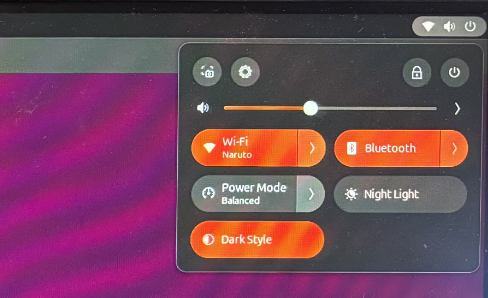
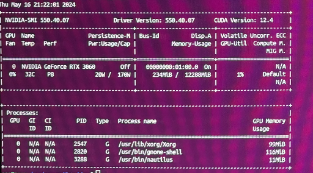

# Welcome to GitHub Desktop!
Hello World

##################################
ISSUE 1
##################################

I think lots of people buy this board and try to install Ubuntu on it, but facing driver issues:
    1. WIFI doesn`t work.
    2. Bluetooth doesn`t work either.

Official website support Win11 LAN drivers download but Ubuntu, So i tried install:
1. Ubuntu 18.04 (too old)
2. Ubuntu 20.04 (recommend install and wifi&bluetooth not working)
3. Ubuntu 24.04 (finally i installed this LTS versioin)

###################################
SOLUTION
###################################

!!!! WHATS YOU NEED TO DO !!!! :
1. Open your web browser and searching " linux-kernel-69rc1-released " or you can use this address " https://kernel.ubuntu.com/mainline/v6.9-rc7/amd64/ "

2. Download four "linux-*.deb" by clicking the link:
linux-headers-6.9.0-060900rc7-generic_6.9.0-060900rc7.202405052133_amd64.deb	 
linux-headers-6.9.0-060900rc7_6.9.0-060900rc7.202405052133_all.deb
linux-image-unsigned-6.9.0-060900rc7-generic_6.9.0-060900rc7.202405052133_amd64.deb	 
linux-modules-6.9.0-060900rc7-generic_6.9.0-060900rc7.202405052133_amd64.deb

3. sudo apt update && sudo dpkg -i ./*.deb
After awhile, may be 1 minute is enough then you will get a succeed prompt from your terminal and " reboot " you Ubuntu.

4. Congratulations! WIFI & Bluetooth is working NOW !!!

##################################
ISSUE 2
##################################

About your Nvidia Graphic card.
Mine is MSI Geforce 3060 Super, and i download the driver from NVIDIA official website after few steps its working by type "nvidia-smi". You can msg me if you get issues.

#############################
#############################

All above, best regards !!!!!
